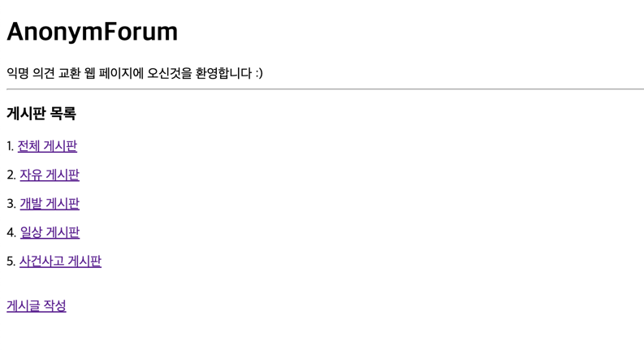

# [SpringBoot] Project - AnonymForum


## ☀️ 프로젝트 소개
- 익명 의견 교환 웹 페이지 서비스 🗣️




## 💻 개발 환경

- Java : `17`
- Framework : `Spring Boot 3.2.1`
- Build : `gradle`
- DataBase : `SQLite`
  - 임시로 SQLite 를 적용하였고, 추후에 다른 데이터베이스로 적용할 예정입니다.
- ORM : `JPA`


## 🌳 패키지 구조


```bash
└── src
    ├── main
    │   ├── java
    │   │   └── com
    │   │       └── example
    │   │           └── AnonymForum
    │   │               ├── AnonymForumApplication.java
    │   │               ├── controller
    │   │               │   ├── ArticleController.java
    │   │               │   ├── BoardController.java
    │   │               │   └── CommentController.java
    │   │               ├── entity
    │   │               │   ├── ArticleEntity.java
    │   │               │   ├── BoardEntitiy.java
    │   │               │   └── CommentEntity.java
    │   │               ├── repository
    │   │               │   ├── ArticleRepository.java
    │   │               │   ├── BoardRepository.java
    │   │               │   └── CommentRepository.java
    │   │               └── service
    │   │                   ├── ArticleService.java
    │   │                   ├── BoardService.java
    │   │                   └── CommentService.java
    │   └── resources
    │       ├── application.yml
    │       ├── data.sql
    │       ├── static
    │       └── templates
    │           ├── article
    │           │   ├── read.html
    │           │   └── update.html
    │           └── board
    │               ├── create.html
    │               ├── home.html
    │               └── read.html
    └── test
        └── java
            └── com
                └── example
                    └── AnonymForum
                        └── AnonymForumApplicationTests.java


```

## 📚 DB 설계


## 📌 목차


- [기능 요구사항](#기능-요구사항)
- [기능 구현 방식](#-기능-구현-벙식)
    - [1. Entity](#1-entity)
      - [BoardEntity](#boradentity)
      - [ArticleEntity](#articleentity)
      - [CommentEntity](#commententity)
    - [2. Repository](#2-repository)
      - [BoardRepository](#boardrepository)
      - [ArticleRepository](#articlerepository)
      - [CommentRepository](#commentrepository)
    - [3. Service](#3-service)
      - [BoardService](#boardservice)
      - [ArticleService](#articleservice)
      - [CommentService](#commentservice)
    - [4. Controller](#4-controller)
      - [BoardController](#boardcontroller)
      - [ArticleController](#articlecontroller)
      - [CommentController](#commentcontroller)
    - [5. Templates](#5-templates)
      - [board/home.html](#boardhomehtml)
      - [board/read.html](#boardreadhtml)
      - [board/create.html](#boardcreatehtml)
      - [article/read.html](#articlereadhtml)
      - [article/update.html](#articleupdatehtml)
- [개발 진행중 발생한 어려움에 대한 기록](#진행중-발생한-어려움에-대한-기록)
- [Spring Boot 프로젝트 실향](#프로젝트-실행)
  - [git clone](#git-clone)
  - [datasource 설정](#datasource-설정)
  - [application.yml 설정](#applicationyml-설정)
- [테스트 방법](#테스트-방법)
  - [게시판 목록 확인하기](#게시판-목록-확인하기)
  - [게시물 작성하기](#게시물-작성하기)
  - [특정 게시판의 게시물 목록 확인하기](#특정-게시판의-게시물-목록-확인하기)
  - [전체 게시판 확인하기](#전체-게시판-확인하기)
  - [단일 게시물 페이지 들어가기](#단일-게시물-페이지-들어가기)
  - [게시물 수정하기](#게시물-수정하기)
  - [게시물 삭제하기](#게시물-삭제하기-생략)
  - [댓글 작성하기](#댓글-작성하기)
  - [댓글 삭제하기](#댓글-삭제하기-생략)
- [결론](#결론)

## ✅ 기능 요구사항

### 필수 기능 요구사항
<details>
  <summary><b>1. 게시판 기능(완료)</b></summary>
  <div markdown="1">
    <ul>
      <li>게시판 목록과, 선택된 게시판의 게시글 목록을 볼 수 있는 화면이 필요하다.</li>
      <li>게시판 목록의 링크를 선택하면, 해당 게시판에 작성된 게시글 제목만 목록으로 출력되는 화면으로 이동한다.</li>
      <li>전체 게시글을 위한 전체 게시판이 존재한다.</li>
      <li>게시글 제목은 링크로, 해당 게시글의 정보를 전부 조회할 수 있는 페이지로 이동된다.</li>
      <li>조회되는 게시글들은 항상 나중에 작성된 게시글이 최상단에 작성된다.</li>
      <li>자유 게시판, 개발 게시판, 일상 게시판, 사건사고 게시판이 존재한다.</li>
    </ul>
  </div>
</details>
<details>
  <summary><b>2. 게시글 기능(완료)</b></summary>
  <div markdown="2">
    <ul>
      <li>게시글을 작성할 수 있다.</li>
      <li>게시글을 작성하는 페이지가 필요하다.</li>
      <li>게시글을 작성하는 페이지에서 어떤 게시판에 작성할지를 선택 가능하다.</li>
      <li>게시글의 제목과 내용을 작성한다.</li>
      <li>게시글의 내용 자체는 Plain Text로만 구성된다.</li>
      <li>게시글을 작성할 때는 작성자가 자신임을 증명할 수 있는 비밀번호를 추가해서 작성한다.</li>
      <li>게시글 단일 조회 화면이 필요하다.</li>
      <li>게시글을 수정할 수 있다.</li>
      <li>게시글을 수정하는 페이지가 필요하다.</li>
      <li>게시글을 수정하는 페이지에는, 게시글의 본래 제목, 글이 존재한다.</li>
      <li>게시글 수정을 위해 비밀번호를 제출할 수 있어야 한다.</li>
      <li>게시글을 삭제할 수 있다.</li>
      <li>단일 게시글 조회 페이지에 있는 삭제를 위한 UI를 이용해 삭제한다.</li>
      <li>게시글 삭제를 위해 비밀번호를 제출할 수 있어야 한다.</li>
    </ul>
  </div>
</details>
<details>
  <summary><b>3. 댓글 기능(완료)</b></summary>
  <div markdown="3">
    <ul>
      <li>댓글을 작성할 수 있다.</li>
      <li>댓글의 작성은 게시글 단일 조회 페이지에서 이뤄진다.</li>
      <li>댓글을 작성할 때는 작성자가 자신임을 증명할 수 있는 비밀번호를 추가해서 작성한다.</li>
      <li>댓글의 목록은 게시글 단일 조회 페이지에서 확인이 가능하다.</li>
      <li>댓글의 삭제는 게시글 단일 조회 페이지에서 가능하다.</li>
      <li>댓글 삭제를 하기 위한 UI가 존재해야 한다.</li>
      <li>댓글 삭제를 위해 비밀번호를 제출할 수 있어야 한다.</li>
    </ul>
  </div>
</details>

### 추가 기능 요구사항
1. 해시태그 기능
2. 검색 기능
3. 게시글 추가 기능


## 📝 기능 구현 방식

## 1. Entity
게시판, 게시글, 댓글에 대한 기본적인 엔티티 클래스를 작성하고 이들을 SQLite 데이터베이스 테이블에 저장한다.

### BoradEntity
  - 게시판을 표현할 Board 엔티티 클래스
  - 컬럼 
    - 고유 게시판 id 와, 게시판이름인 board_id 
  ```java
  @Data
  @Entity
  @Table(name="board")
  public class BoardEntity { 
        @Id
        @GeneratedValue(strategy = GenerationType.IDENTITY)
        private Long id;
        @Column(name="board_name")
        private String board_name;
  }
  ```
### ArticleEntity
  - 게시글을 표현할 Article 엔티티 클래스 
  - 컬럼
    - 게시글의 id, 게시글의 제목 title, 게시글의 내용 content, 게시글의 비밀번호 password
    - 게시판의 id 인 board_id , ManyToOne 관계 매핑(article(N) : board(1))
  ```java
  @Data
  @Entity
  @Table(name="article")
  public class ArticleEntity implements Comparable<ArticleEntity>{
        @Id
        @GeneratedValue(strategy = GenerationType.IDENTITY)
        private Long id;
        private String title;
        private String content; 
        private Long password;
    
        // 여러개의 article(N) : board(1) 의 관계
        @ManyToOne
        @JoinColumn(name = "board_id")  
        private BoardEntitiy board;
    
        // 게시판과 댓글의 양방향 관계 매핑
        @OneToMany(mappedBy = "article", cascade = CascadeType.ALL)
        @ToString.Exclude
        private List<CommentEntity> comments = new ArrayList<>();
        // 게시글 관련 메서드 및 필드
    
        @Override
        public int compareTo(ArticleEntity other) {
                // id를 기준으로 내림차순 정렬
                return other.getId().compareTo(this.getId());
  }
  ```    
    
### CommentEntity
  - 댓글을 표현할 Comment 엔티티 클래스
  - 컬럼
    - 댓글 id, 댓글 내용 message, 댓글 비밀번호 password
    - 게시글의 id 인 article_id, ManyToOne 관계 매핑(Comment(N) : article(1))
  ```java
  @Data
  @Entity
  @Table(name="comment")
  public class CommentEntity {
        @Id
        @GeneratedValue(strategy = GenerationType.IDENTITY)
        private Long id;
        private String message;
        private Long password;

        @ManyToOne
        @JoinColumn(name = "article_id")
        private ArticleEntity article;
  }
  ```
  
---
     
## 2. Repository
각 엔티티에 대한 Repository 인터페이스로 데이터베이스와의 상호작용을 통한 CRUD 작업을 쉽게 할 수 있도록 한다.

### BoardRepository
  - Board 엔티티에 대한 Repository 인터페이스
  ```java
  @Repository
  public interface BoardRepository extends JpaRepository<BoardEntity, Long> {}
  ```
### ArticleRepository
  - Article 엔티티에 대한 Repository 인터페이스
  ```java
  @Repository
  public interface ArticleRepository extends JpaRepository<ArticleEntity, Long> {
      List<ArticleEntity> findAllByBoardId(Long boardId);
  }
  ```
### CommentRepository
  - Comment 엔티티에 대한 Repository 인터페이스
  ```java
  @Repository
  public interface CommentRepository extends JpaRepository<CommentEntity, Long> {
      List<CommentEntity> findAllByArticleId(Long articleId);
  }
  ```

---

## 3. Service
각 엔티티에 대한 비즈니스 로직을 처리하는 서비스 클래스
### BoardService
  - `readOneBoard(Long id)`
    - 특정 게시판의 정보를 가져오는 메서드
    - 주어진 게시판 ID에 해당하는 게시판 엔티티를 조회하고, 존재하면 해당 엔티티를 반환
    - Optional 을 사용하여 null 을 반환하지 않도록 구현
    ```java
    public BoardEntity readOneBoard(Long id) 
        Optional<BoardEntity> optionalBoard = boardRepository.findById(id);
        return optionalBoard.orElse(null);
    ```
  - `readAllBoards();`
    - 모든 게시판의 목록을 가져오는 메서드
    - 데이터베이스에 저장된 모든 게시판 엔티티를 조회하고, 목록으로 반환
    ```java
    public List<BoardEntity> readAllBoards() {
        return boardRepository.findAll();
    ```
  - `readBoardById(Long boardId)`
    - 특정 게시판의 정보를 Optional 로 반환하는 메서드
    - 주어진 게시판 ID에 해당하는 게시판 엔티티를 조회하고, Optional 로 감싸서 반환
    ```java
    public Optional<BoardEntity> readBoardById(Long boardId) {
        return boardRepository.findById(boardId);
    ```
### ArticleService
  - `createArticle(title, content, password, boadId)` 
    - 새로운 게시물을 생성하는 메서드
    - 제목, 내용, 비밀번호, 속한 게시판의 ID(boardId)를 인자로 받아 ArticleEntity 객체를 생성하고 저장
    ```java
    public void createArticle(
            String title,
            String content,
            Long password,
            Long boardId
    ) {
        ArticleEntity article = new ArticleEntity();
        article.setTitle(title);
        article.setContent(content);
        article.setPassword(password);

        Optional<BoardEntity> optionalBoardEntity = boardRepository.findById(boardId);
        optionalBoardEntity.ifPresent(article::setBoard);

        articleRepository.save(article);
    ```
  - `readArticles(Long boardId)`
    - 특정 게시판(boardId)에 속한 모드 게시물을 가져오는 메서드.
    ```java
    public List<ArticleEntity> readArticles(Long boardId) {
        return articleRepository.findAllByBoardId(boardId);
    ```
  - `readAllArticles()`
    - 모든 게시물을 가져오는 메서드
    ```java
    public List<ArticleEntity> readAllArticles() {
        return articleRepository.findAll();
    ```
  - `readOneArticle(Ling articleId)` 
    - 특정 게시물(articleId)을 가져오는 메서드
    - Optional 을 사용하여 해당 ID에 해당하는 게시물이 존재하면 반환하고, 그렇지 않으면 null 을 반환
    ```java
    public ArticleEntity readOneArticle(Long articleId) {
        return articleRepository.findById(articleId).orElse(null);    
    ```
  - `ArticleSortById(List<ArticleEntity> articles)`
    - 게시물을 ID를 기준으로 내림차순으로 정렬하는 메서드
    - Collections.sort()를 사용하여 정렬된 리스트를 반환
    ```java
    public List<ArticleEntity> ArticleSortById(List<ArticleEntity> articles) {
        Collections.sort(articles);
        return articles;
    ```
  - `updateArticle(id, title, content, password)`
    - 게시물을 수정하는 메서드
    - 주어진 ID에 해당하는 게시물을 불러와 비밀번호를 확인한 후, 일치하면 제목과 내용을 업데이트하고 저장
    ```java
    public void updateArticle(
            Long id,
            String title,
            String content,
            Long password
    ) {
        ArticleEntity article = readOneArticle(id);
        if (article.getPassword().equals(password)) {
            article.setTitle(title);
            article.setContent(content);
            articleRepository.save(article);
        } else {
            throw new RuntimeException("비밀번호가 일치하지 않습니다.");
        }
    ```
  - `deleteArticle(Long id, Long password)`
    - 게시물을 삭제하는 메서드
    - 주어진 ID에 해당하는 게시물을 불러와 비밀번호를 확인한 후, 일치하면 해당 게시물을 삭제
    ```java
    public void deleteArticle(Long id, Long password) {
        ArticleEntity article = readOneArticle(id);
        if (article.getPassword().equals(password)) {
            articleRepository.deleteById(id);
        } else {
            throw new RuntimeException("비밀번호가 일치하지 않습니다.");
        }
    ```
### CommentService
  - `createComment()`
    - 새로운 댓글을 생성하는 메서드
    - 메세지, 비밀번호, 헤당 게시물의 ID 를 인자로 받아 CommentEntity 객체를 생성하고 저장
    ```java
    public void createComment(
            String message,
            Long password,
            Long articleId
    ) {
        CommentEntity comment = new CommentEntity();
        comment.setMessage(message);
        comment.setPassword(password);

        Optional<ArticleEntity> optionalArticleEntity = articleRepository.findById(articleId);
        optionalArticleEntity.ifPresent(comment::setArticle);

        commentRepository.save(comment);
    ```
  - `readAllCommentsById(Long articleId)`
    - 특정 게시물(articleId)에 속한 모든 댓글을 가져오는 메서드
    ```java
    public List<CommentEntity> readAllCommentsById(Long articleId) {
        return commentRepository.findAllByArticleId(articleId);
    ```
  - `readOneCommentById(Long commentId)`
    - 특정 댓글(commentId)을 가져오는 메서드
    - Optional 을 사용하여 해당 ID에 해당하는 댓글이 존재하면 반환하고, 그렇지 않으면 null을 반환
    ```java
    public List<CommentEntity> readAllCommentsById(Long articleId) {
        return commentRepository.findAllByArticleId(articleId);
    ```
  - `deleteComment(articleId, commentId, password)`
    - 댓글을 삭제하는 메서드
    - 주어진 commentId에 해당하는 댓글을 불러와 비밀번호를 확인한 후, 일치하면 해당 댓글을 삭제
    ```java
    public void deleteComment(
            Long articleId,
            Long commentId,
            Long password
    ) {
        CommentEntity comment = readOneCommentById(commentId);
        if (comment.getPassword().equals(password)) {
            commentRepository.deleteById(commentId);
        } else {
            throw new RuntimeException("비밀번호가 일치하지 않습니다.");
        }
    ```

---

## 4. Controller
각 엔티티에 대한 컨트롤러 클래스(BoardController, ArticleController, CommentController) 를 구현하여
클라이언트로부터 요청을 처리하고, 서비스 계층과 연결한다.
### BoardController
- `readAllBoards(Model model)`
  - 모든 게시판의 목록을 조회하여 홈 화면에 표시한다.
  - `boardService.readAllBoards()` 를 통해 모든 게시판 정보를 가져온다.
```java
@GetMapping("")
public String readAllBoards(Model model) {
    model.addAttribute("AllBoards", boardService.readAllBoards());
    return "board/home";
}
```
- `readOneBoard(@PathVariable("boardId") Long boardId, Model model)`
  - 선택한 게시판의 게시물을 조회하여 상세 화면에 표시합니다.
  - `articleService.readAllArticles()` 또는 `articleService.readArticles(boardId)`를 통해 게시물 정보를 가져오고, 
  내림차순으로 정렬합니다.
  - 선택한 게시판 정보를 가져와 모델에 추가합니다.
```java
// 선택한 id의 게시판 보기
// boardId = 2 에 해당하는 게시글을 보여주면 된다.
@GetMapping("/{boardId}")
public String readOneBoard(@PathVariable("boardId") Long boardId, Model model) {
    List<ArticleEntity> articles;

    if (boardId.equals(1L)) {
        // 전체 게시판인 경우 모든 게시물 가져오기
        articles = articleService.readAllArticles();
    } else {
        // 특정 게시판인 경우 해당 게시판의 게시물 가져오기
        articles = articleService.readArticles(boardId);
    }
    // id 를 기준으로 내림차순
    model.addAttribute("articles", articleService.ArticleSortById(articles));

    // 게시판 정보 가져오기
    Optional<BoardEntitiy> optionalBoardEntity = boardService.readBoardById(boardId);
    optionalBoardEntity.ifPresent(boardEntity -> model.addAttribute("board", boardEntity));

    return "board/read";
}
```

- `create(Model model)`
  - 게시글을 작성하기 위한 화면을 보여줍니다.
  - 모든 게시판의 목록을 가져와 모델에 추가하여 작성할 게시판을 선택할 수 있게 합니다.
```java
// 몇번(id) 게시판에, 게시글 작성화면 보기
@GetMapping("/create-view")
public String create(Model model) {
    List<BoardEntity> boardEntityList = boardService.readAllBoards();
    model.addAttribute("AllBoards", boardEntityList);
    // 게시글 작성 화면 보여주기 (Get)
    return "board/create";
}
```

- `create(title, content, password, boardId)`
  - 게시글을 작성하고, 작성한 후에는 홈 화면으로 리다이렉트합니다.
  - `articleService.createArticle(...)`를 통해 새로운 게시글을 생성합니다.
```java
// 몇번(id) 게시판에, 게시글 작성하고 전송
@PostMapping("/create-view")
public String create(
        @RequestParam("title")
        String title,
        @RequestParam("content")
        String content,
        @RequestParam("password")
        Long password,
        @RequestParam("boardId")
        Long boardId
) {
    articleService.createArticle(title, content, password, boardId);
    return "redirect:/boards";
}
```

### ArticleController

- `readOneArticle(@PathVariable("articleId") Long id, Model model)`
  - 특정 게시글의 내용과 해당 게시글에 달린 댓글 목록을 조회하여 상세 화면에 표시합니다.
  - 게시글 정보와 댓글 목록을 모델에 추가합니다.
  - 뒤로 가기 버튼을 위해 해당 게시글이 속한 게시판의 정보도 모델에 추가합니다.
```java
@GetMapping("{articleId}")
public String readOneArticle(@PathVariable("articleId") Long id, Model model) {
    ArticleEntity articleEntity = articleService.readOneArticle(id);
    List<CommentEntity> comments = commentService.readAllCommentsById(id);
    model.addAttribute("article", articleEntity);
    model.addAttribute("comments", comments);

    // 뒤로 가기 버튼을 위한 board 객체 가져와 모델에 추가
    Long boardId = articleEntity.getBoard().getId();
    BoardEntity board = boardService.readOneBoard(boardId);
    model.addAttribute("board", board);

    return "article/read";
}
```

- `updateArticleView(@PathVariable("articleId") Long id, Model model)`
  - 특정 게시글을 수정하기 위한 화면을 보여줍니다.
  - 수정할 게시글의 정보를 가져와 모델에 추가하여 화면에 미리 표시합니다.
```java
@GetMapping("/{articleId}/update-view")
public String updateArticleView(@PathVariable("articleId") Long id, Model model) {
    // 아이디를 가지고 해당 article 의 정보를 얻어오도록 service 에게 요청
    ArticleEntity article = articleService.readOneArticle(id);
    model.addAttribute("article", article);
    return "article/update";
}
```

- `updateArticle(...)`
  - 게시글을 수정하고, 수정 후에는 해당 게시글의 상세 화면으로 리다이렉트합니다.
  - `articleService.updateArticle(...)`를 통해 게시글을 업데이트하고, 
  비밀번호가 일치하지 않을 경우 예외 처리하여 에러 메시지와 함께 수정 화면으로 이동합니다.
```java
@PostMapping("/{articleId}/update-view")
public String updateArticle(
        @PathVariable("articleId")
        Long id,
        @RequestParam("title")
        String title,
        @RequestParam("content")
        String content,
        @RequestParam("password")
        Long password
) {
    try {
        articleService.updateArticle(id, title, content, password);
        return "redirect:/article/{articleId}";
    } catch (RuntimeException e) {
        // 비밀번호가 일치하지 않을 경우 에러 메세지와 함꼐 다시 수정 폼으로 이동
        return "redirect:/article/" + id + "/update-view?error=password";
    }
}
```

- `deleteArticle(@PathVariable("articleId") Long id, @RequestParam("password") Long password)`
  - 게시글을 삭제하고, 삭제 후에는 홈 화면으로 리다이렉트합니다.
  - `articleService.deleteArticle(...)`를 통해 게시글을 삭제하고, 비밀번호가 일치하지 않을 경우 예외 처리하여
  에러 메시지와 함께 상세 화면으로 이동합니다.
```java
@PostMapping("{articleId}/delete")
public String deleteArticle(
        @PathVariable("articleId")
        Long id,
        @RequestParam("password")
        Long password
) {
    try {
        articleService.deleteArticle(id, password);
        return "redirect:/boards";
    } catch (RuntimeException e) {
        return "redirect:/article/" + id + "?articleError=password";
    }
}
```

### CommentController
메서드들은 각각의 기능을 수행하며, 모델에 필요한 데이터를 추가하여 뷰에 전달합니다. 
댓글 목록 조회, 댓글 작성, 댓글 삭제 등의 기능이 효과적으로 수행됩니다.

- `readAllComments(@PathVariable("articleId") Long id, Model model)`
  - 특정 게시글에 속한 모든 댓글을 조회하여 해당 게시글의 상세 화면에 표시합니다.
  - `commentService.readAllCommentsById(id)`를 통해 댓글 목록을 가져와 모델에 추가합니다.
```java
@GetMapping("/article/{articleId}/comment")
public String readAllComments(
        @PathVariable("articleId")
        Long id,
        Model model
) {
    model.addAttribute("comments", commentService.readAllCommentsById(id));
    return "article/read";
}
```

- `createComment(...)`
  - 게시글에 새로운 댓글을 작성하고, 작성 후에는 해당 게시글의 상세 화면으로 리다이렉트합니다.
  - `commentService.createComment(...)`를 통해 새로운 댓글을 생성합니다.
```java
// 댓글 작성
@PostMapping("/article/{articleId}/comment")
public String createComment(
        @RequestParam("message")
        String message,
        @RequestParam("password")
        Long password,
        @PathVariable("articleId")
        Long articleId
) {
    commentService.createComment(message, password, articleId);
    return "redirect:/article/{articleId}";
}
```

- `deleteComment(...)`
  - 특정 댓글을 삭제하고, 삭제 후에는 해당 게시글의 상세 화면으로 리다이렉트합니다.
  - `commentService.deleteComment(...)`를 통해 댓글을 삭제하고, 
  비밀번호가 일치하지 않을 경우 예외 처리하여 에러 메시지와 함께 상세 화면으로 이동합니다.
```java
// 댓글 삭제
@PostMapping("/article/{articleId}/comment/{commentId}/delete")
public String deleteComment(
        @PathVariable("articleId")
        Long articleId,
        @PathVariable("commentId")
        Long commentId,
        @RequestParam("password")
        Long password
) {
    try {
        commentService.deleteComment(articleId, commentId, password);
        return "redirect:/article/{articleId}";
    } catch (RuntimeException e) {
        return "redirect:/article/" + articleId + "?commentError=password";
    }
}
```

---

## 5. Templates
Thymeleaf 템플릿을 활용하여 각 기능에 대한 화면을 작성한다. 게시물 목록, 게시물 상세 보기, 댓글 목록등의 화면을 사용자에게 제공한다.


### board/home.html
`board/home.html` 은 홈 페이지에서 게시판 목록을 보여주고, 사용자에게 게시판을 선택하고 새로운 게시글을 작성할 수 있는 기능을 
제공한다.

- 게시판 목록 표시
```html
<h3>게시판 목록</h3>
<div th:each="board: ${AllBoards}">
    <p>[[${board.id}]]. <a th:href="@{/boards/{id}(id=${board.id})}">[[${board.board_name}]]</a></p>
</div>
```
- 게시글 작성 링크
```html
<a href="/boards/create-view">게시글 작성</a>
```


### board/read.html
`board/read.html`은 특정 게시판의 게시글 목록을 보여주고, 각 게시글로 이동할 수 있는 링크를 제공한다.

- 게시판 이름 표시
```html
<h1 th:text="${board.boardName}"></h1>
```

- 게시글 목록 표시
```html
<h3>게시물 목록</h3>
<div th:each="article : ${articles}">
    <p><a th:href="@{/article/{id}(id=${article.id})}" th:text="${article.title}"></a></p>
</div>
```
- 뒤로가기 링크
```html
<a th:href="@{/boards}">뒤로 가기</a>
```

### board/create.html
`board/create.html` 은 사용자에게 게시글 작성을 위한 입력 폼을 제공하며, 선택한 게시판에 새로운 게시글을 작성할 수 있도록 한다.

- 폼(Form)
  - `/boards/create-view` 경로로 POST 방식으로 제출할 떄 해당 경로로 이동하도록 action 과 mothod 작성  
  - 제목, 내용, 비밀번호 입력 
  - 게시판 선택 
    - `<select>` 를 사용하여 게시글을 어느 게시판에 작성할지 선택하는 드롭다운 구성
    - th:each 디렉티브를 사용하여 `${AllBoards}` 에 있는 게시판 목록을 순회하고, 각각의 게시판을 옵션으로 추가
  - 글 생성 버튼
  - 뒤로가기 링크
```html
<form th:action="@{'/boards/create-view'}" method="post">
    <div>
        <label>
            제목: <input type="text" name="title" placeholder="제목을 입력하세요">
        </label>
    </div>
    <div>
        <label>
            내용 : <input type="text" name="content" placeholder="내용을 입력하세요">
        </label>
    </div>
    <div>
        <label>
            비밀번호 : <input type="password" name="password" placeholder="비밀번호을 입력하세요">
        </label>
    </div>
    <div>
        <label>
            게시판 선택 :
            <select name="boardId">
                <option th:each="board: ${AllBoards}" th:value="${board.id}" th:text="${board.boardName}"></option>
            </select>
        </label>
    </div>
    <button type="submit">글 생성</button>
    <br>
    <a th:href="@{/boards}">뒤로 가기</a>
</form>
```

### article/read.html
`article/read.html` 은 특정 게시글을 상세하게 표시하며, 게시글 제목, 내용, 수정 및 삭제 기능, 댓글 작성 및 표시, 댓글 삭제 기능, 
그리고 댓글 삭제 시 에러 메시지를 제공한다. 페이지 하단에는 해당 게시글이 속한 게시판으로 돌아가기 위한 링크가 제공된다.

- 게시글 정보 표시
```html
<h2 th:text="${article.title}"></h2> <!-- 게시글 제목 -->
<p th:text="${article.content}"></p> <!-- 내용 -->
```

- 게시글 수정 및 삭제
  - "수정하기" 링크
    - 수정하기 링크를 클릭하면 해당 게시글의 수정 페이지로 이동
  - 삭제 폼(Form)
    - 사용자가 비밀번호를 입력하고 삭제 버튼을 누르면 해당 게시글이 삭제된다.
    - 삭제할 게시글의 id와 비밀번호를 포함한 경로가 설정 되어있다.
    - 삭제 시 비밀번호 오류가 발생하면 에러 메세지가 표시된다.
```html
<div>
    <h3>편집하기</h3>
    <a th:href="@{/article/{id}/update-view(id=${article.id})}">수정하기</a>
    <form th:action="@{/article/{id}/delete(id=${article.id})}" method="post">
        <label>
            <p>삭제하기 : <input type="password" name="password" placeholder="비밀번호를 입력하세요."><input type="submit" value="삭제"></p>
        </label>
        <div th:if="${param.articleError}">
            <p style="color: red;">비밀번호가 일치하지 않습니다.</p>
        </div>
    </form>
</div>
```
- 댓글 생성
    - 댓글 생성 폼(Form)
      - 댓글을 작성할 수 있는 폼을 제공하여, 사용자는 댓글 내용과 비밀번호를 입력하고 추가버튼을 누르면 댓글이 추가된다
    - 댓글 목록
      - `${comments}`에 댓글 목록이 있을 경우, 해당 게시글에 작성된 댓글들을 표시 
      - 각 댓글은 댓글 내용과 삭제 버튼이 포함되어 있다.
      - 댓글 삭제 시 비밀번호가 일치하지 않으면 에러 메시지가 표시된다.
```html
<div>
    <h3>댓글 작성</h3>
    <form th:action="@{/article/{id}/comment(id=${article.id})}" method="post">
        <label>
            <p>사용자 PW 입력 : <input type="password" name="password" placeholder="비밀번호를 입력하세요."></p>
        </label>
        <label>
            <p>댓글 쓰기 : <input type="text" name="message" placeholder="댓글을 입력하세요."><input type="submit" value="추가"></p>
        </label>
    </form>
</div>
```

- 댓글 목록 표시 및 삭제
  - 댓글 목록
    - `${comments}`에 댓글 목록이 있을 경우, 해당 게시글에 작성된 댓글들을 표시
    - 각 댓글은 댓글 내용과 삭제 버튼이 포함되어 있다.
    - 댓글 삭제 시 비밀번호가 일치하지 않으면 에러 메시지가 표시된다.
  - 댓글 삭제 폼(Form)
    - 댓글을 삭제하려면 해당 댓글의 비밀번호를 입력하고 삭제 버튼을 누른다.
    - 삭제 시 비밀번호 오류가 발생하면 에러 메세지가 표시된다.
    - `<div th:if="${param.commentError}">` 댓글 삭제 시 비밀번호가 일치하지 않을 때 표시되는 에러 메시지.
```html
<h3>댓글 목록</h3>
<div th:if="${comments}">
    <!-- 특정 게시물의 댓글들 -->
    <div th:each="comment : ${comments}">
        <div>
            <p th:text="${comment.message}"></p>
            <!-- 댓글 삭제 버튼 -->
            <form th:action="@{/article/{articleId}/comment/{commentId}/delete(articleId=${article.id}, commentId=${comment.id})}" method="post" style="display: inline;">
                <input type="password" name="password" placeholder="비밀번호를 입력하세요."><input type="submit" value="삭제">
            </form>
        </div>
    </div>
    <div th:if="${param.commentError}">
        <p style="color: red;">비밀번호가 일치하지 않습니다.</p>
    </div>
</div>
```
- 뒤로 가기 링크
  - 해당 게시글이 속한 게시판으로 돌아기기 위한 링크
```html
<a th:href="@{/boards/{id}(id=${board.id})}">뒤로 가기</a>
```


### article/update.html
`article/update.html` 은 게시글을 수정하는 데 필요한 정보를 입력하는 폼을 제공하고, 수정 시 발생한 오류에 대한 메시지를 표시한다.

- 제목, 내용, 비밀번호 입력 폼
  - th:value 를 사용하여 서버에서 받아온 기존 게시글의 정보를 미리 입력란에 표시한다.
- 에러 표시 부분
  - 수정 시 발생한 비밀번호 오류에 대한 에러 메세지 표시
  - `${param.error}` 는 URL의 쿼리 매개변수 중 "error' 가 존재할 경우에 true
- 저장 버튼
  - 사용자가 수정한 게시글 정보를 서버에 전송하여 저장하는 버튼
  - 폼의 `th:action` 속성에 정의된 URL로 데이터 전송된다.
```html
<h1>게시글 수정하기</h1>
<form th:action="@{/article/{id}/update-view(id=${article.id})}" method="post">
  <div>
    <label>
      제목: <input type="text" name="title" th:value="${article.title}">
    </label>
  </div>
  <div>
    <label>
      내용 : <input type="text" name="content" th:value="${article.content}">
    </label>
  </div>
  <div>
    <label>
      비밀번호 : <input type="password" name="password" placeholder="비밀번호을 입력하세요">
    </label>
  </div>
  <!-- 수정 폼에서 에러 메시지를 표시하는 부분 -->
  <div th:if="${param.error}">
    <p style="color: red;">비밀번호가 일치하지 않습니다.</p>
  </div>
  <input type="submit" value="저장">
</form>
```

---

## 어려웠던 점을 어떻게 해결했는지

1. 타임리프 문법
   - 문제 
     - 특정 URL 요청을 컨트롤러가 받고 서비스의 비즈니스 로직 처리 후 해당 데이터를 모델에 담아 뷰로 보낼떄
     - 어떤 HTML 요소들에 어떤 타임 리프 문법이 적용되어야 하는지 익숙하지 않았다.
   - 해결
     - 구글 자료 참고
     - 일부 문법 요약
       - 변수 표현식 : `${board.boardName}`
       - 선택 및 반복 : `th:if`, `th:unless`, `th:each`
       - 속성 바인딩 : `th:src`, `th:href`
       - URL 링크 처리 : `@{/article/{id}/update-view(id=${article.id})`
       - 폼 처리 : `th:action`


2. JPA Query Method
   - 문제 
     - `findById` 로는 단일 엔티티 반환만 가능하다. 하지만 하나의 `Id` 로 여러개의 엔티티 리스트를 얻어오기 위해서 추가적인 메서드가 필요
   - 해결
     - `JPA Query Method` 는 `Spring Data JPA` 에서 제공하는 간편한 쿼리 생성 기능이다.
     - `JPA Query Method` 로 해결
     ```java
     @Repository
     public interface CommentRepository extends JpaRepository<CommentEntity, Long> {
        List<CommentEntity> findAllByArticleId(Long articleId);
     }
     ```

3. Optional
   - 문제 
     - 서비스 단의 메서드를 만들 때, 메서드 전체를 Optional 로 할것인지, 내부 객체를 Optional 로 감싸는지를 선택함에 있어서 어려움을 겪었다.
   - 해결 
     - 내부 객체를 Optional 로 감싸는 방식 채택하여
     - MVC 패턴에서 서비스 레이어가 비즈니스 로직 처리에 더 많은 책임을 지게끔 했던 것 같다.
   - 방법
     - 메서드 전체를 `Optional` 로 감싸기
       - 메서드가 Optional 을 반환하도록 한다.
       - 이 경우, 메서드를 호출한 곳에서는 `Optional`의 메서드를 활용하여 값의 존재 여부를 체크하고 안전하게 처리할 수 있다.
       ```java
       public Optional<BoardEntity> readBoardById(Long boardId) {
          return boardRepository.findById(boardId);
       }
       ```
       - 호출
       ```java
       @GetMapping("/{boardId}")
       public String readOneBoard(@PathVariable("boardId") Long boardId, Model model) {
          ...
          // 게시판 정보 가져오기
          Optional<BoardEntity> optionalBoardEntity = boardService.readBoardById(boardId);
          optionalBoardEntity.ifPresent(boardEntity -> model.addAttribute("board", boardEntity));
       ```
     - 메서드 내부의 객체를 `Optional`로 감싸고 값 혹은 null 반환
       - 메서드의 반환 타입은 Optional 이 아닌 기본 타입이나 객체 타입이며, 내부에서 Optional을 사용하여 값 혹은 null 을 다룬다.
       - 이 경우, 호출하는 측에서 일반적인 객체에 접근하듯이 처리할 수 있다.
       ```java
       public BoardEntity readOneBoard(Long id) {
           Optional<BoardEntity> optionalBoard = boardRepository.findById(id);
           return optionalBoard.orElse(null);
       }
       ```
       - 호출
       ```java
       @GetMapping("{articleId}")
       public String readOneArticle(@PathVariable("articleId") Long id, Model model) {
           ...
           // 뒤로 가기 버튼을 위한 board 객체 가져와 모델에 추가
           Long boardId = articleEntity.getBoard().getId();
           BoardEntity board = boardService.readOneBoard(boardId);
           model.addAttribute("board", board);
       ```
       
   - 메서드 전체를 Optional 로 감싸면 나중에 HTML 에서 th:if 로 isPresent() 에 따라 ${article.get().id} 런식으로 get() 메서드 사용
   - 만약 내부에서 Optional 을 처리하면 그냥 ${article.id} 접근 가능 (실제 값이든 null 이든 들어가있을 테니까)
     


4. 내림차순 정렬 
   - 문제
     - `ArticleEntity` 객체들을 내림차순 정렬을 해야 현재 겍체가 더 앞에 위치할 수 있다, 따라서 내림 차순을 구현해야 한다.
   - 해결
     - `ArticleEntity` 클래스의 객체를 ID를 기준으로 내림차순으로 정렬하기 위해 `compareTo` 메서드를 구현한다.
     - `compareTo` 메서드는 `Comparable` 인터페이스에서 제공하는 메서드로, 두 객체를 비교하여 정렬 순서를 결정할 수 있다.
     ```java
     @Override
     public int compareTo(ArticleEntity other) {
     // id를 기준으로 내림차순 정렬
          return other.getId().compareTo(this.getId());
     }
     ```
 

5. 엔티티 클래스에서 `@toString` 순환 참조로 인해 무한 재귀 호출이 발생 
   - 문제점
     - 반적으로 `Thymeleaf`나 다른 뷰 템플릿에서 모델을 이용하여 객체를 표현할 때, 해당 객체의 `toString` 메서드가 자동으로 호출될 수 있습니다. 
     - 이러한 호출은 주로 `th:text`, `th:value` 등의 템플릿 엔진에서 사용되는 표현식에서 일어난다.
     - 문제는 `ArticleEntity` 클래스와 `CommentEntity` 클래스 간에 양방향 관계가 설정되어 있다는 점이다.
     - 이 때, `Lombok`의 `@Data` 애너테이션은 기본적으로 모든 필드에 대한 `toString` 메서드를 생성하므로, 
     양방향 관계에서 서로를 무한히 호출하는 순환 참조로 이어질 수 있다.
   - 해결 
     - Lombok에서 제공하는 `@ToString.Exclude` 애너테이션을 활용하여 특정 필드를 `toString()` 메서드에서 제외시킨다.
     - 예를 들어, `@ToString.Exclude`를 `comments` 필드에 적용하면, 해당 필드는 `toString()`에서 제외되어 무한 재귀 호출을 방지할 수 있다.
     ```java
     @Data
     @Table(name="article")
     public class ArticleEntity implements Comparable<ArticleEntity>{

     // 게시판과 댓글의 양방향 관계 매핑
     @OneToMany(mappedBy = "article", cascade = CascadeType.ALL)
     @ToString.Exclude
     private List<CommentEntity> comments = new ArrayList<>();
     ```


6. 에러메세지 중복 문제 
   - 문제점 
     - `<div th:if="${param.error}">` 라는 코드가 중복 사용되는 문제
   - 해결
     - Thymeleaf 템플릿 파일에서 `<div th:if="${param.error}">` 부분을 `<div th:if="${param.articleError}">`로 수정
     - 컨트롤러에서 리다이렉트 `URL`을 생성할 때 `articleError`로 변경합니다.
     ```java
     // Before
     return "redirect:/article/" + articleId + "?articleError=password";

     // After
     return "redirect:/article/" + articleId + "?articleError=password";
     ```
   

7. DB를 `H2 Database` 로 변경 시 `Table "BOARD" not found` 오류
   - 문제점
     - 원할한 개발을 위해 기존 데이터베이스로 `SQLite`를 선택하여 진행하였고, 이후 완성된 프로젝트를 특별한 설정 없이 
     실행이 가능한도록 만들기 위해 `H2 Database` 의 `in-memory`모드를 구현하고자 했다.
     - 설정 과정에서 `data.sql`, `application.yml` 파일의 일부를 수정하였지만 `BOARD` 라는 테이블을 찾을 수 없다는 오류가 나왔다.
   - 해결
     - 기본적으로 `H2 Database`는 대소문자를 구분하지 않는 경우가 많아 발생한 오류라고 판단하여 아래와 같이 해당 엔티티 클래스의
     필드 이름은 `Camelcase` 유지하되, `@Column(name = "board_name")` 어노테이션을 사용
     - 이 설정을 통해 데이터베이스 테이블이 생성될 떄 해당 필드를 `board_name` 으로 생성하여 대소문자의 오류를 피한다.
     ```java
     @Column(name="board_name")
         private String boardName;
     ```

## 프로젝트 실행
### git clone
우선 해당 프로젝트의 주소 복사하여 git clone 을 통해 소스코드를 폴더를 다운로드 합니다.
```bash
Github 레포지토리 클론
$ git clone https://github.com/m1nddoong/Mission_OOO.git
```

그리고 `IntelliJ` 에서 `Mission_OOO` 프로젝트를 `Open` 해준다.

### datasource 설정
프로젝트가 열리면 오른쪽 `Database` 메뉴를 클릭해 `datasource`로 `SQL Lite` 를 추가한다.


파일 이름을 `db.sqlite` 로 수정하고 OK 버튼을 눌러준다.


`datasource`를 추가해주고 난 뒤 `src/main/java/com/example/AnonymForum/AnonymForumApplication.java`
라는 클래스 파일의 Main 문을 실행한면 아래와 같이 3개의 테이블이 만들어지고, `board` 테이블에 더미 데이터가 추가된 것을
확인할 수 있다.


### application.yml 설정

`ddl-auto: update` 로 바꿔주고, `data.sql` 내부 `SQL` 문을 실행시키지 않게 하기 위해 
`sql.init.mode: always` 를 주석처리한다.

```yml
spring:
  datasource:
    url: jdbc:sqlite:db.sqlite
    driver-class-name: org.sqlite.JDBC
    # username : sa
    # password : password
  jpa:
    hibernate:
      # dde-auto: create
      ddl-auto: update
    show-sql: true
    database-platform: org.hibernate.community.dialect.SQLiteDialect
    defer-datasource-initialization: true
#  sql:
#    init:
#      mode: always
```

## 테스트 방법

### 게시판 목록 확인하기
웹 페이지에 접속하기 위해서 http://localhost:8080/boards 를 웹 브라우저의 URL로 입력하면 다음과 같은 홈페이지 화면이 나온다.
게시판 목록을 확인할 수 있고 하단의 게시물 작성하기로 게시물을 작성할 수 있다.


### 게시물 작성하기
아래의 내용을 작성한 뒤 `글 생성` 을 클릭한다. (비밀번호 : `1111`)


### 특정 게시판의 게시물 목록 확인하기
게시판 목록에서 `자유 게시판` 을 클릭하여 게시물 목록에 `점메추` 라는 항목이 있음을 확인한다.


### 전체 게시판 확인하기
앞선 게시물 작성하기와 동일한 과정으로 각 게시판에 게시물을 하나씩 생성해준다. 그런 다음 `1. 전체게시판` 을 클릭하면
가장 최근에 작성한 게시물이 상단에 위치한 전체 게시판의 게시물들의 리스트를 확인할 수 있다.


### 단일 게시물 페이지 들어가기
게시물 목록에서 `점메추` 를 클릭하면 아래와 같은 단일 게시물 페이지 화면을 볼 수 있다.


### 게시물 수정하기
게시물 수정하기 버튼을 누르면 게시글 수정하기 페이지로 이동한다. 아까 설정했던 비밀번호 `1111` 을 올바르게 입력한 뒤 `저장` 을 클릭하면
게시글이 수정된다. (비밀번호를 틀렸을 경우 다음과 같이 비밀번호가 틀렸다는 `오류` 문구 출력)


### 게시물 삭제하기 (생략)
게시물을 작성할 때 입력한 비밀번호(`1111`)를 입력한 뒤 `삭제` 버튼을 누르면 게시물이 삭제되고 홈페이지(게시판 목록)로 이동한다.


### 댓글 작성하기
비밀번호(`2222`)로 입력하고, 댓글을 작성한 뒤 `추가` 버튼을 누르면 다음과 같이 댓글 목록에 댓글이 추가된 것을 볼 수 있다.


### 댓글 삭제하기 (생략)
댓글을 작성할 떄 입력한 비밀번호(`2222`)를 입력한 뒤, "저녁으로 치킨 ㄱㄱ" 라고 하는 댓글 오른쪽의 `삭제` 버튼을 클릭하면
해당 댓글이 지워진다. 


## 결론
이 프로젝트를 통해 Spring Boot 를 사용하여 웹 애플리케이션을 개발하는 기초적인 단계를 익힐 수 있었다. 게시판, 게시뮬, 댓글에
 대한 간단한 구현을 통해 전체적인 웹 개발 프로세스를 이해하는데 도움이 되었다.

